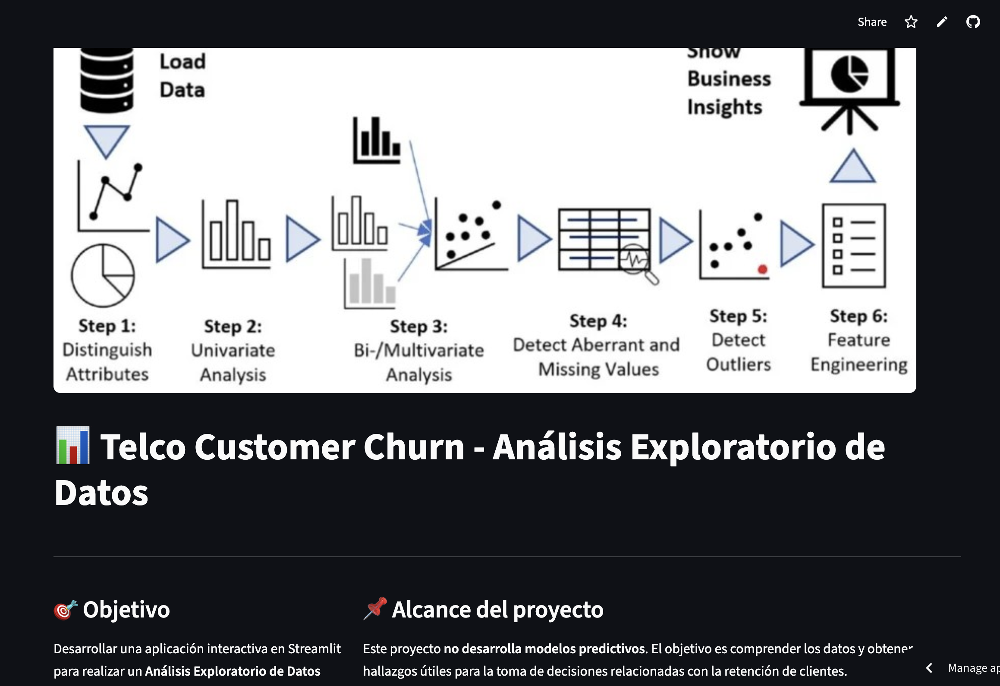
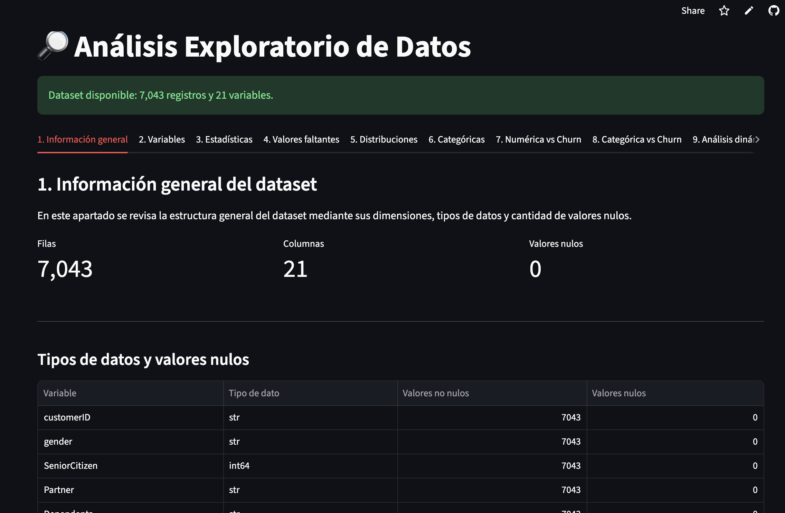
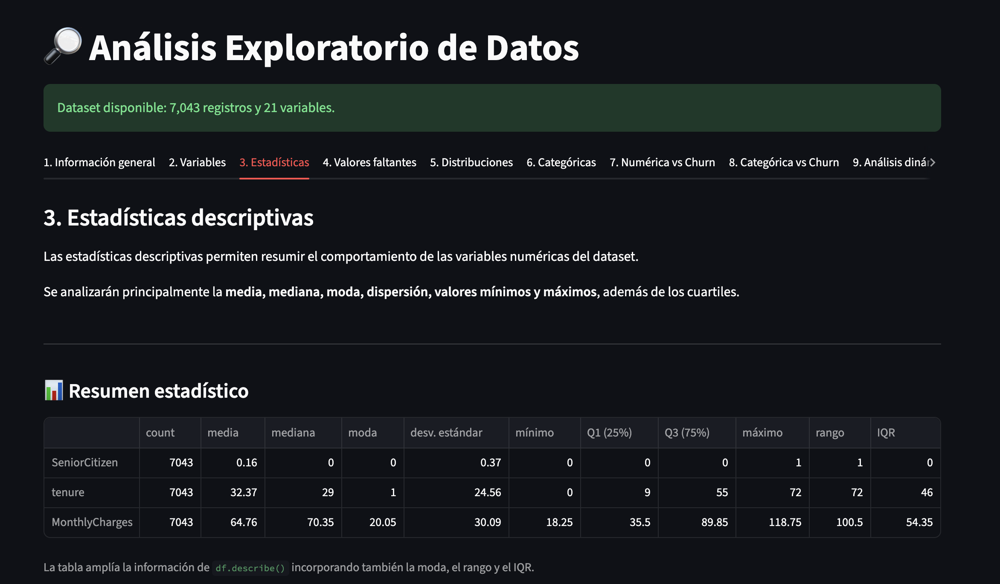
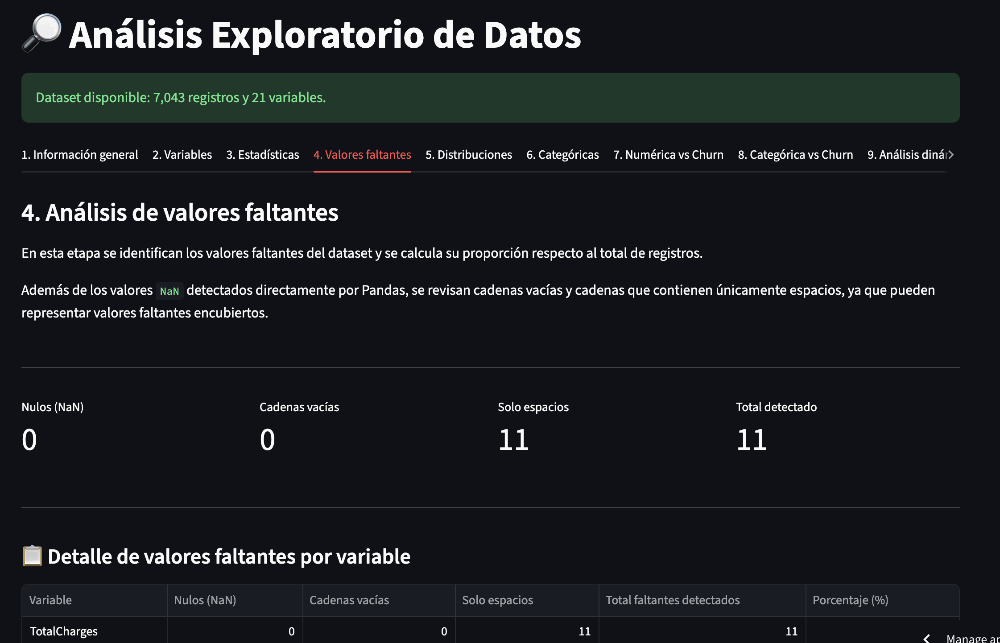
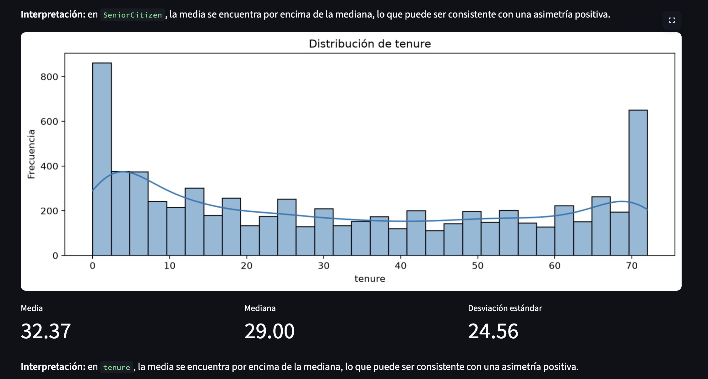
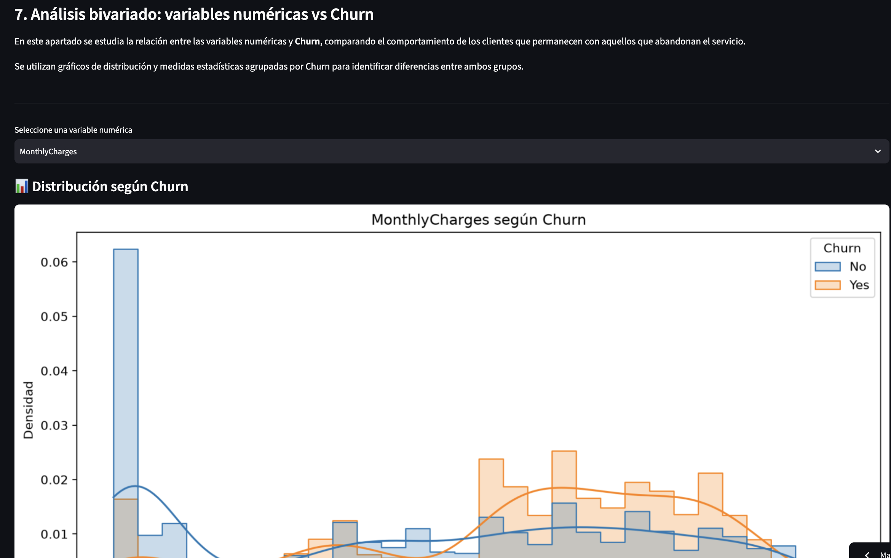
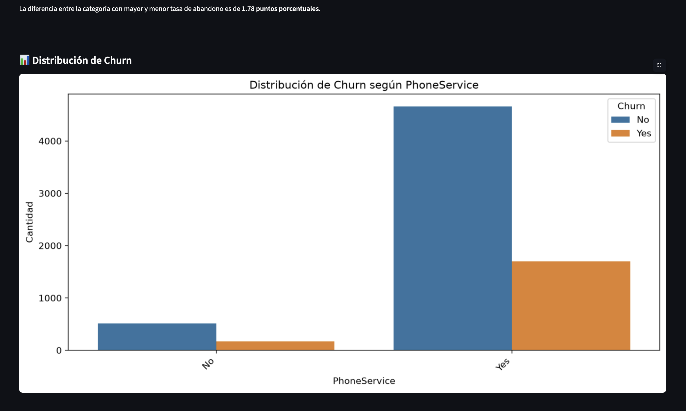
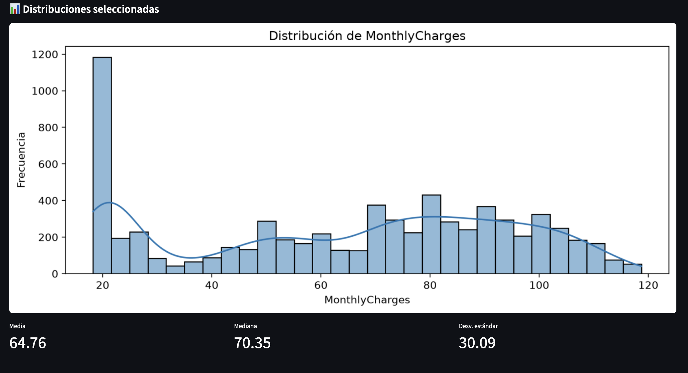
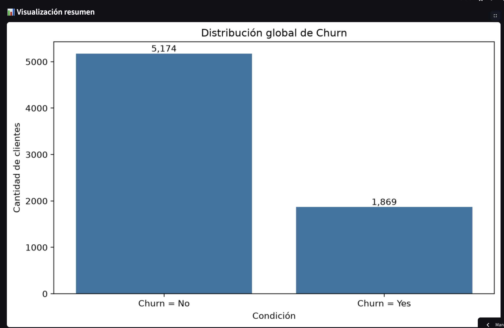

# Análisis Exploratorio de Datos (EDA) — Churn de Clientes

## 1. Descripción del proyecto

Este proyecto desarrolla una aplicación interactiva en **Python + Streamlit** para realizar un **Análisis Exploratorio de Datos (EDA)** sobre un conjunto de datos de clientes, con especial enfoque en la variable objetivo **`Churn`**.

El objetivo es explorar la estructura y calidad de los datos, identificar patrones relevantes y transformar los resultados del análisis en **hallazgos útiles para la toma de decisiones**, especialmente en relación con la retención de clientes.

### Funcionalidades principales

La aplicación está organizada en módulos/tablas de análisis que permiten:

1. **Información general**
   - Visualización del tamaño del dataset.
   - Revisión general de los datos.

2. **Clasificación de variables**
   - Identificación de variables numéricas y categóricas.
   - Diferenciación de variables relevantes para el análisis.

3. **Estadísticas descriptivas**
   - Media, mediana, desviación estándar, mínimos y máximos.
   - Resumen estadístico de las variables numéricas.

4. **Valores faltantes**
   - Identificación y cuantificación de datos faltantes.
   - Revisión de registros que contienen valores ausentes.

5. **Distribuciones numéricas**
   - Histogramas.
   - Curvas KDE.
   - Exploración de la distribución de las variables.

6. **Variables categóricas**
   - Frecuencias.
   - Porcentajes.
   - Visualizaciones de las categorías principales.

7. **Variables numéricas vs. Churn**
   - Comparación entre clientes con y sin abandono.
   - Histogramas.
   - Boxplots.
   - Medias y medianas por grupo.

8. **Variables categóricas vs. Churn**
   - Tablas de contingencia.
   - Porcentajes de Churn por categoría.
   - Identificación de segmentos con mayor tasa de abandono.

9. **Análisis dinámico**
   - Selección interactiva de variables mediante `selectbox` y `multiselect`.
   - Control del número de categorías mediante `slider`.
   - Exploración dinámica de variables numéricas, categóricas y su relación con Churn.

10. **Hallazgos clave**
    - Indicadores generales de Churn.
    - Visualización resumen.
    - Identificación de diferencias relevantes entre grupos.
    - Cinco conclusiones orientadas a la toma de decisiones.

### Enfoque de negocio

El análisis no se limita a describir los datos. Los hallazgos se utilizan para orientar decisiones relacionadas con:

- identificación de segmentos con mayor riesgo de abandono;
- focalización de estrategias de retención;
- priorización de variables relevantes;
- seguimiento de la tasa de Churn;
- preparación de una futura etapa de analítica predictiva.

Los resultados del EDA son **descriptivos y exploratorios**. Las diferencias observadas no deben interpretarse como relaciones causales ni como evidencia de significancia estadística sin realizar pruebas adicionales.

---

## 2. Capturas de la app

> **Nota:** esta sección está preparada para incorporar las capturas finales de la aplicación una vez que se haya realizado el despliegue definitivo.

### Pantalla principal



### Información general y clasificación de variables



### Estadísticas descriptivas



### Valores faltantes



### Distribuciones numéricas



### Análisis numérico vs Churn



### Análisis categórico vs Churn



### Análisis dinámico



### Hallazgos clave




---

## 3. Instrucciones de ejecución

### Requisitos

Se recomienda utilizar un entorno virtual de Python para aislar las dependencias del proyecto.

Streamlit recomienda trabajar con un entorno virtual y permite instalarse mediante `pip`. La documentación oficial actual soporta Python 3.10–3.14.  
Referencia: https://docs.streamlit.io/get-started/installation/command-line

### 3.1. Clonar el repositorio

```bash
git clone <URL_DEL_REPOSITORIO>
cd <NOMBRE_DEL_REPOSITORIO>
```

### 3.2. Crear un entorno virtual

#### Windows

```bash
python -m venv .venv
.venv\Scripts\activate
```

#### macOS / Linux

```bash
python3 -m venv .venv
source .venv/bin/activate
```

### 3.3. Instalar dependencias

Si el proyecto contiene un archivo `requirements.txt`:

```bash
pip install -r requirements.txt
```

Si todavía no existe, instalar como mínimo las librerías utilizadas por la aplicación:

```bash
pip install streamlit pandas numpy matplotlib seaborn
```

### 3.4. Ejecutar la aplicación

Ubicarse en la carpeta donde se encuentra `app.py` y ejecutar:

```bash
streamlit run app.py
```

Streamlit iniciará un servidor local y normalmente abrirá la aplicación en el navegador. La forma oficial de ejecución es `streamlit run <archivo>.py`.  
Referencia: https://docs.streamlit.io/develop/concepts/architecture/run-your-app

También puede ejecutarse mediante:

```bash
python -m streamlit run app.py
```

### 3.5. Detener la aplicación

En la terminal:

```text
Ctrl + C
```

### 3.6. Ejecución en Streamlit Community Cloud

Para publicar la aplicación:

1. Subir el proyecto a GitHub.
2. Verificar que `app.py` sea el archivo principal.
3. Incluir `requirements.txt` con las dependencias.
4. Crear una aplicación en Streamlit Community Cloud.
5. Seleccionar el repositorio, rama y archivo principal.
6. Realizar el despliegue.

---

## 4. Links relevantes

### Documentación oficial

- [Streamlit — Documentación oficial](https://docs.streamlit.io/)
- [Instalación de Streamlit](https://docs.streamlit.io/get-started/installation)
- [Cómo ejecutar una aplicación Streamlit](https://docs.streamlit.io/develop/concepts/architecture/run-your-app)
- [Conceptos básicos de Streamlit](https://docs.streamlit.io/get-started/fundamentals/main-concepts)
- [Referencia de comandos CLI de Streamlit](https://docs.streamlit.io/develop/api-reference/cli)

---

## Tecnologías utilizadas

- **Python**
- **Streamlit**
- **Pandas**
- **NumPy**
- **Matplotlib**
- **Seaborn**

---

## Estructura sugerida del proyecto

```text
proyecto/
│
├── app.py
├── requirements.txt
├── README.md
├── TelcoCustomerChurn.csv

│
└── Capturas/
    ├── home.png
    ├── informacion_general.png
    ├── estadisticas_descriptivas.png
    ├── valores_faltantes.png
    ├── distribuciones_numericas.png
    ├── numerica_vs_churn.png
    ├── categorica_vs_churn.png
    ├── analisis_dinamico.png
    └── hallazgos.png
```

## Autor

**Proyecto de Análisis Exploratorio de Datos — Churn**

Desarrollado con Python y Streamlit por Nick Flores.
